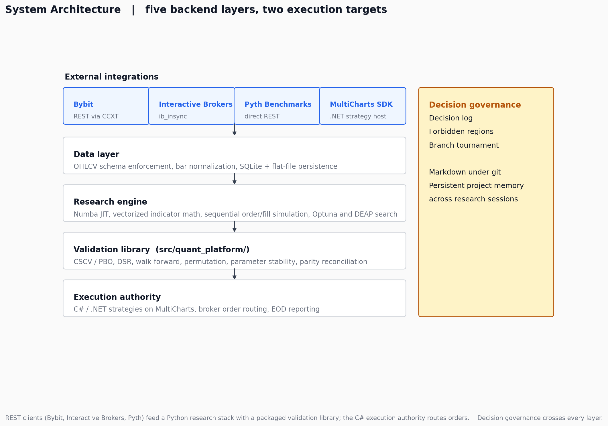
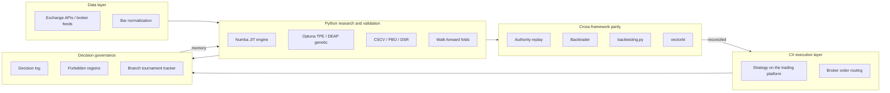
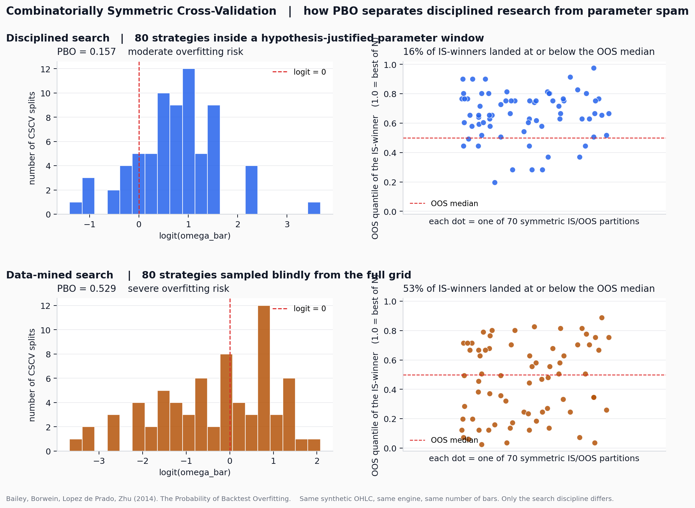

# Quantitative Trading Research Platform

[](https://www.python.org/downloads/)
[](#system-architecture)
[](#system-architecture)
[](tests/)
[](docs/methodology.md)
[](LICENSE)

> A backend platform for systematic trading research. C# execution, Python
> research stack, REST API integrations, cross-framework data
> reconciliation, and a packaged validation library.



## What this is

A backend platform built around a Python validation library, REST API
integrations to multiple exchanges and brokers, and a cross-framework
reconciliation layer that diffs strategy execution across five
independent backtesting environments. The C# execution layer routes
orders to the broker; the Python research stack runs the experiments.

This repository is a public, sanitized showcase. It includes the package
structure (`src/quant_platform/`), the test suite, the data pipeline
components, runnable demonstrations on synthetic data, and the system
architecture and engineering decisions behind the platform. The actual
strategy code, real parameters, and trade logs are in a separate private
repository.

## What calling the library looks like

```python
import numpy as np
from quant_platform import (
    regime_switching_ohlc,
    sma_crossover_signals,
    walk_forward_folds,
    deflated_sharpe_ratio,
)

# Synthetic OHLC with known regime structure
bars = regime_switching_ohlc(n_bars=8_000, seed=42)
close = bars["close"]

# Anchored walk-forward folds, IS = 60% / OOS = 40% per fold
folds = walk_forward_folds(n_bars=len(close), n_folds=6, is_fraction=0.6)

# Reference strategy: SMA crossover signals, shifted by one bar so the
# returned -1 / 0 / +1 series is strictly causal
signals = sma_crossover_signals(close, fast_window=8, slow_window=30)

# Deflated Sharpe corrects an observed Sharpe for the selection bias
# from picking the best of N trials
dsr = deflated_sharpe_ratio(
    observed_sharpe=1.2,
    n_observations=len(close),
    n_trials=200,
    sharpe_variance_across_trials=0.04,
)
print(f"DSR = {dsr:.3f}")
```

The example uses the actual public API exported by
[`src/quant_platform/__init__.py`](src/quant_platform/__init__.py). Every
function is type-hinted, docstring-cited to the source paper, and covered
by the pytest suite under [`tests/`](tests/).

## What this demonstrates

- **REST API client engineering across multiple exchanges and brokers.**
  Bybit through CCXT for crypto perpetuals (paginated OHLCV with
  rate-limit handling and verification artifacts). Interactive Brokers
  through `ib_insync` for futures historical data with retry behavior
  tuned to IB constraints. Pyth Benchmarks through direct REST with
  response-status handling and symbol resolution.
- **Cross-framework integration testing.** The same strategy is
  implemented in five independent execution environments (C# on
  MultiCharts, a custom Numba-compiled Python engine, Backtrader,
  `backtesting.py`, and vectorbt). Trade lists are diffed bar by bar
  until they reconcile. Catches bugs that any single-framework test
  would silently hide.
- **Packaged Python library with public API and tests.**
  `src/quant_platform/` is `pip install -e .` ready, exports a typed
  public API, and is validated by a pytest suite that checks
  implementations against published values from the literature.
- **Performance engineering through Numba JIT.** The custom backtest
  engine separates vectorizable indicator math (NumPy) from inherently
  sequential order/fill simulation (Numba `@njit` inner loop). Roughly
  a thousand backtests per second on a laptop. Same vectorize-then-
  sequence pattern that turns up in shader code and many other
  performance-sensitive systems.
- **Decision governance as a software artifact.** A Markdown decision
  log, a forbidden-region list, and a branch tournament tracker form
  the project's persistent memory across research sessions. The pattern
  generalizes: it is what an Architecture Decision Record (ADR) looks
  like when applied to research instead of architecture.

Interested in: 
- [Software Engineering](for-recruiters/software-engineering.md)
- [Quant / Quantitative Research](for-recruiters/quant-roles.md)
- [AI / ML](for-recruiters/ai-ml-roles.md)

## System architecture

The hero diagram above is the high-level view. The Mermaid diagram below
shows the same architecture in more detail, with the governance feedback
loop on the bottom that most quant diagrams omit.



The bottom feedback loop is the part most diagrams omit. It is what stops
the project from cycling through the same falsified hypotheses every
quarter.

The full layer-by-layer walkthrough, with the why-decisions table, is in
[`docs/architecture.md`](docs/architecture.md).

## Engineering layers

The system splits into five backend concerns, each one a self-contained
package or module.

- **External integrations.** REST clients for Bybit (via CCXT),
  Interactive Brokers (via `ib_insync`), and Pyth Benchmarks (direct
  REST). Connection management, retry logic, response validation,
  rate-limit handling, and persistence to local storage.
- **Data layer.** OHLCV schema enforcement at ingest, SQLite plus
  flat-file persistence, manifest tracking. Strict input contracts so
  downstream code never sees malformed bars.
- **Research engine.** `src/quant_platform/`. Python package with the
  validation library, parity reconciler, synthetic data generators,
  and reference strategy. Type-hinted, docstring-cited, pytest-tested,
  installable as a package.
- **Execution authority.** C# / .NET strategies running on
  MultiCharts. Live broker connectivity, position state, EOD reporting.
  Constrained by the platform's strategy SDK; not in this public
  repository.
- **Decision governance.** Markdown decision log, forbidden-region
  list, branch tournament tracker. Persistent project memory across
  research sessions, kept under git.

For the layer-by-layer reasoning and the why-decisions table, see
[docs/architecture.md](docs/architecture.md). For the engineering-rationale
breakdown of every stack choice, see
[docs/why-this-stack.md](docs/why-this-stack.md).

## Validation methodology

The validation library implements published statistical machinery for
catching backtest overfitting and selection bias. Every implementation
in `src/quant_platform/validation/` is paired with tests that check it
against worked examples from the source papers.



The figure above shows the headline result from
[`demos/cscv_pbo_demo.py`](demos/cscv_pbo_demo.py): two strategy
populations of equal size, one hypothesis-justified and one sampled
blindly from the full grid, with a 3.4x difference in their Probability
of Backtest Overfitting under the same engine and the same synthetic
data. The implementation follows Bailey, Borwein, Lopez de Prado, and
Zhu (2014), Algorithm 2.3.

The other four demos and the full methodology breakdown are in
[docs/methodology.md](docs/methodology.md).

## Try it yourself

```
git clone https://github.com/Linja1337/quant-research-platform
cd quant-research-platform
pip install -e .
python demos/cscv_pbo_demo.py
```

The script runs in a few seconds. Five demos in [`demos/`](demos/)
exercise the validation library on synthetic data and produce the
charts referenced throughout this README.

## About the code

The strategies that actually trade live are not in this repository. The
platform is a research engine and a validation library; the alpha lives
elsewhere. What is shown here is the engineering work behind the
platform: the API integrations, the package structure, the validation
library, the parity reconciliation, the test suite, and the
architectural decisions.

The demos use synthetic data generated from regime-switching geometric
processes. There are no real instrument calibrations, no real parameter
values, and no real PnL numbers anywhere in the public artifacts.

## Contact

Built by Salman Linjawi.
GitHub: [Linja1337](https://github.com/Linja1337)
Email: s-linjawi@outlook.com
