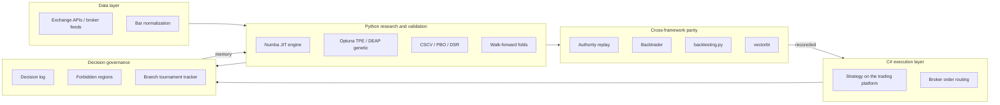

# Quantitative Trading Research Platform

[](https://www.python.org/downloads/)
[](#architecture)
[](docs/methodology.md)
[](LICENSE)

> A research and validation platform for systematic trading strategies. Built
> around the assumption that any backtest is overfit until proven otherwise.


## What this is

A hybrid C# and Python platform for designing systematic futures and crypto
strategies, validating them with statistical machinery from the academic
literature (CSCV, PBO, DSR, walk-forward, permutation tests), and reconciling
execution semantics across multiple backtesting frameworks before any live
deployment.

This repository is a public, sanitized showcase. It includes the architecture,
the validation methodology, runnable synthetic-data demonstrations of every
technique, and the engineering decisions behind the stack. The actual strategy
code, real parameters, and trade logs are in a separate private repository.

## Why this is interesting

- **Validation is the headline, not the strategies.** Every candidate goes
  through walk-forward, CSCV, DSR, permutation testing, parameter stability,
  and cross-framework parity audits before it gets a serious look. The bar
  is non-negotiable.
- **Cross-framework parity audits.** The same strategy is implemented in the
  C# execution platform and in three independent Python frameworks
  (Backtrader, backtesting.py, vectorbt). If the trade lists do not agree,
  one of the implementations has a bug. This catches things that any single
  framework would silently hide.
- **Decision-log governance.** Every hypothesis is logged with its result.
  Every falsified hypothesis becomes a "forbidden region" the system refuses
  to revisit without explicit override. The project's long-term memory is a
  Markdown file, which is what makes the research process reproducible across
  sessions and tooling changes.
- **Engineering for speed.** The Numba-compiled engine runs roughly a
  thousand backtests per second on a laptop. That is what makes 200-trial
  Optuna sweeps and 80-configuration CSCV grids feasible without a cluster.

## Hiring for a specific role?

- [Software Engineering](for-recruiters/software-engineering.md)
- [Quant / Quantitative Research](for-recruiters/quant-roles.md)
- [AI / ML](for-recruiters/ai-ml-roles.md)

## Architecture



The bottom feedback loop is the part most diagrams omit. It is what stops the
project from cycling through the same falsified hypotheses every quarter.

The full layer-by-layer walkthrough, with the why-decisions table, is in
[`docs/architecture.md`](docs/architecture.md).

## Methodology highlights

- **Walk-forward validation** with calendar-day windows so that holidays and
  session gaps do not break the IS / OOS bookkeeping.
- **CSCV / PBO** following Bailey, Borwein, Lopez de Prado, and Zhu (2014)
  Algorithm 2.3. Operational target: PBO < 0.10.
- **Deflated Sharpe Ratio** following Bailey and Lopez de Prado (2014). Uses
  the False Strategy Theorem with the Euler-Mascheroni form for the expected
  maximum Sharpe under the null. Operational target: DSR > 0.95.
- **Permutation tests** with day-block shuffling that preserves intraday
  autocorrelation while destroying inter-day temporal structure.
- **Parameter stability surfaces** that distinguish plateaus from
  knife-edges. A profitable parameter setting whose neighbors all collapse
  is a knife-edge fit, not a discovery.

Each technique has a section in [`docs/methodology.md`](docs/methodology.md)
with a plain-English summary, the formal definition, and the operational
threshold this platform uses.

## Try it yourself

```
git clone https://github.com/Linja1337/quant-research-platform
cd quant-research-platform
pip install -r requirements.txt
python demos/cscv_pbo_demo.py
```

The script runs in a few seconds. It writes the hero chart at the top of
this README to `demos/output/cscv_pbo.png`. The
[demos/](demos/) folder contains four more self-contained demonstrations of
the validation methodology, each on synthetic data.

## About the code

The strategies that actually trade live are not in this repository. The
platform is a research engine and a validation framework; the alpha lives
elsewhere. What is shown here is the architecture, the validation machinery,
the engineering decisions, and the governance pattern that the live work
operates inside.

The demos use synthetic data generated from regime-switching geometric
processes. There are no real instrument calibrations, no real parameter
values, and no real PnL numbers anywhere in the public artifacts.

## Contact

Built by Salman Linjawi.
GitHub: [Linja1337](https://github.com/Linja1337)
Email: linjakid@gmail.com
