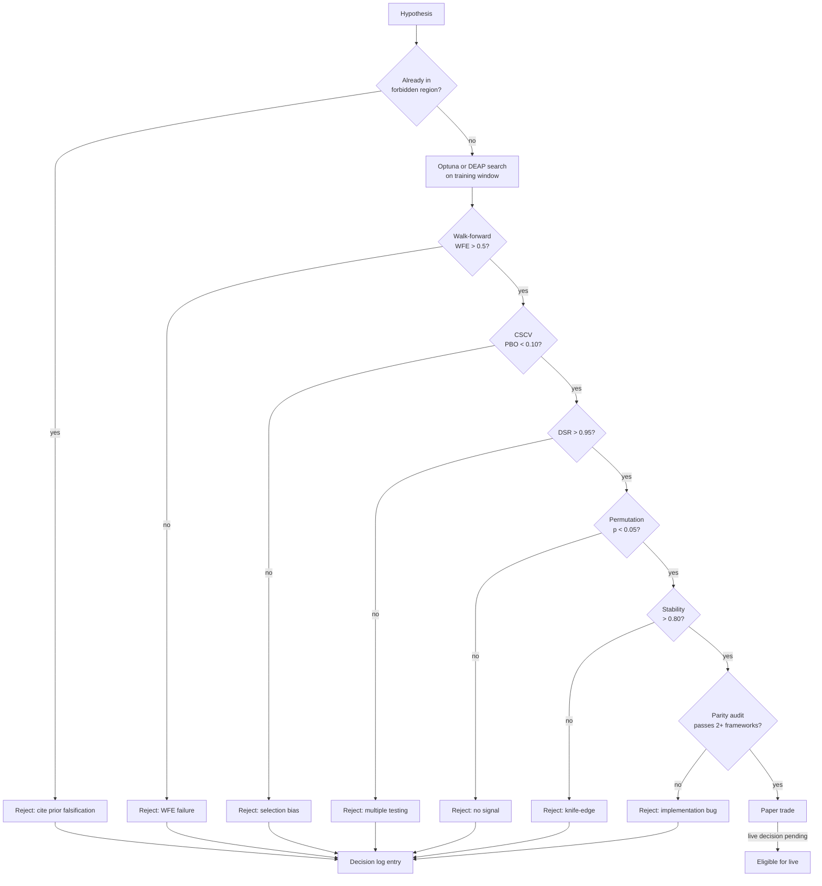

# Architecture

A walk through the system at three depths. Skim the first paragraph of each
section if you only have two minutes. The diagrams and the why-decisions are
where the engineering judgment shows up.

## One-screen view

```mermaid
flowchart LR
    subgraph DataLayer["Data layer"]
        D1["Exchange APIs / broker feeds"]
        D2["Bar normalization"]
        D3["Synthetic generators (demos)"]
    end

    subgraph Research["Python research and validation"]
        R1["Numba JIT engine"]
        R2["Optuna TPE / DEAP genetic"]
        R3["CSCV / PBO / DSR"]
        R4["Walk-forward folds"]
        R5["Permutation tests"]
        R6["Parameter stability"]
    end

    subgraph Parity["Cross-framework parity"]
        P1["Authority replay"]
        P2["Backtrader"]
        P3["backtesting.py"]
        P4["vectorbt"]
    end

    subgraph Execution["C# execution layer"]
        E1["Strategy on the trading platform"]
        E2["Broker order routing"]
    end

    subgraph Governance["Decision governance"]
        G1["Decision log"]
        G2["Forbidden regions"]
        G3["Branch tournament tracker"]
    end

    DataLayer --> Research
    Research --> Parity
    Parity -->|reconciled| Execution
    Research --> Governance
    Execution --> Governance
    Governance -->|memory| Research
```



The thing most diagrams omit is the governance feedback loop on the bottom.
That arrow is what stops the project from cycling through the same falsified
hypotheses every quarter.

## Layer by layer

### Data layer

Inputs are bar-format OHLCV from broker feeds and exchange APIs, normalized
into a single column schema before anything else looks at them. The schema is
strict: each row has a timezone-aware timestamp, open, high, low, close,
volume, and a session indicator. Everything downstream assumes the schema, so
data quality problems get caught at ingest, not deep in a backtest.

Demos do not touch real bars. They use generators in `demos/_synthetic.py`
that produce regime-switching geometric processes with deliberately strong
intra-regime drift. That keeps the demos reproducible and removes any
exposure of real instrument calibration.

### Research and validation layer (Python)

The core research stack. Five components, each independently useful:

1. **The engine.** Vectorized indicator math (NumPy) feeding a Numba-compiled
   bar-by-bar simulator. The architectural decision here matters: indicators
   that can be vectorized (EMAs, ATR, MACD, Heikin-Ashi candles) are
   computed once per backtest in vector form. Order routing, fill modeling,
   stop-loss tracking, trailing-stop logic, and EOD exits live inside a
   Numba `@njit` loop because they are inherently sequential. The split lets
   one full backtest on 5,000 bars finish in single-digit milliseconds,
   which is what makes 200-trial Optuna sweeps and 80-config CSCV grids
   feasible on a laptop.

2. **The optimizers.** Optuna with a Tree-structured Parzen Estimator (TPE)
   sampler for sample-efficient Bayesian search. DEAP with parallel
   multiprocessing for evolutionary search when the parameter space has
   discrete-valued discontinuities the TPE struggles with. Both write to a
   shared trial counter that persists across sessions so the multiple-
   testing burden is not silently reset.

3. **The validators.** CSCV / PBO, Deflated Sharpe, walk-forward folds,
   permutation tests, parameter stability. Each is a self-contained module
   that takes a strategy class and a bar DataFrame and returns a result
   object. The methodology doc describes the math; the code lives in the
   modules named after each technique.

4. **The metrics layer.** Daily Sharpe (correctly annualized: aggregate
   trade PnL by day, then sqrt(252)). Sortino, Calmar, Profit Factor, max
   drawdown, return percentages. One module so every downstream report uses
   the same definitions. Uniform definitions are an underrated source of
   bugs in research codebases.

5. **The strategy contract.** Every strategy is a class with `default_params`,
   `param_space`, `is_valid()`, and `build_signals()`. The optimizers,
   validators, and parity tools all consume that interface, so adding a new
   strategy means writing one file, not modifying five.

### Cross-framework parity layer

Same strategy, different framework, same trade list. That is the whole job.

The parity tools live in their own folder because their job is verification,
not execution. The authority for live trading is the C# / .NET strategy
running on the execution platform; the Python re-implementations exist to
catch bugs in the C# version, and the third-party frameworks (Backtrader,
backtesting.py, vectorbt) exist to catch bugs in the Python re-implementation.

The pattern: each framework gets the same OHLC, the same parameter set, the
same execution semantics (bar-close evaluation, next-bar-open fill, identical
commission and slippage). The output trade lists are compared in a structured
diff. The first divergence is investigated until reconciled. A strategy is
not allowed to be deployed until at least two independent frameworks agree on
its trade list.

The parity-engineering doc walks through the methodology with worked examples.

### Execution layer (C#)

The execution platform is a commercial C# / .NET trading system. Strategies
are PowerLanguage / .NET classes that compile against the platform's strategy
SDK and route orders to the broker. The platform handles connection
management, order book state, position bookkeeping, and end-of-day reporting.

Why C# for execution: the platform's strategy API is C#-only, so any strategy
that runs live runs in C#. The choice was constrained, not preferred.

Why a separate Python research stack: the C# environment is single-threaded
per backtest, GUI-driven, and slow for large parameter sweeps. Anything more
than a one-off backtest moves to Python.

### Decision governance layer

The thing that most repositories do not have. Three artifacts:

1. **The decision log.** Append-only journal of every hypothesis tested.
   Each entry records hypothesis, change, expected outcome, actual outcome,
   verdict, and any follow-up. The log is a single Markdown file with a
   strict per-iteration template. It is the project's working memory.

2. **Forbidden regions.** A list of parameter-space regions and strategy
   architectures that have been falsified, with the citation back to the
   decision-log entry that falsified them. The list is consulted before any
   new hypothesis is proposed. A hypothesis that overlaps with a forbidden
   region must explicitly state why it expects a different result.

3. **The branch tournament tracker.** A living document with a locked
   baseline (data window, cost model, execution semantics) that all
   contemporaneous strategy variants are scored against. The tracker
   prevents accidental comparison drift where two variants get scored
   under subtly different assumptions and the wrong one wins.

The governance layer feeds back into the research layer. New hypotheses are
generated under explicit awareness of what has already been tried. This is
what stops a research project from devolving into the same five ideas being
re-tested under fresh names every quarter.

## Why this stack

The shorter version. Full reasoning lives in `docs/why-this-stack.md`.

| Decision | Choice | Why |
|----------|--------|-----|
| Live execution language | C# | Constrained by the trading platform SDK |
| Research language | Python | Ecosystem (NumPy, pandas, scipy, Optuna, DEAP, Numba) |
| Backtest engine | Custom Numba JIT | 1,000x faster than the platform's GUI backtester |
| Search method | Optuna TPE primary, DEAP fallback | TPE is sample-efficient; DEAP handles discontinuous spaces |
| Validation framework | CSCV + DSR + walk-forward + permutation | Each catches what the others miss |
| Parity tools | Backtrader + backtesting.py + vectorbt | Three independent implementations to catch silent bugs |
| Decision memory | Markdown decision log | Tool-agnostic, diff-able, survives any tooling change |
| Demo data | Synthetic only | Removes IP exposure and instrument calibration from public artifacts |

## How a hypothesis becomes deployment-eligible



Every reject is logged. Every reject contributes to the forbidden-region
list. The next hypothesis benefits from the work that came before.

## Repository layout

```
quant-research-platform/
├── README.md                       Front door
├── ARCHITECTURE.md -> docs/architecture.md (this file)
├── docs/
│   ├── methodology.md              CSCV, DSR, walk-forward, permutation, stability
│   ├── architecture.md             This file
│   ├── parity-engineering.md       Cross-framework parity audits in detail
│   ├── decision-log-philosophy.md  Why a written log changes the research process
│   ├── agentic-research-process.md AI tooling under deterministic validation gates
│   ├── why-this-stack.md           Engineering decisions and what was rejected
│   └── glossary.md                 Plain-English definitions
├── demos/                          Runnable synthetic-data demonstrations
│   ├── README.md
│   ├── cscv_pbo_demo.py
│   ├── walk_forward_demo.py
│   ├── parity_audit_demo.py
│   ├── permutation_test_demo.py
│   ├── parameter_stability_demo.py
│   └── output/                     Committed PNGs from each demo
├── for-recruiters/
│   ├── software-engineering.md
│   ├── quant-roles.md
│   └── ai-ml-roles.md
├── requirements.txt
├── LICENSE
└── technical-brief.pdf             2-page printable summary
```

The actual strategy code, real parameters, live broker connections, and trade
logs are in a separate private repository. This repository is the public
showcase of the platform's architecture, methodology, and engineering
discipline.
